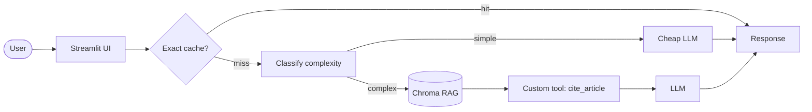

# LGPD Helper — Assistente RAG para Compliance LGPD

> Assistente com IA Generativa que responde dúvidas práticas sobre LGPD usando RAG, citações do corpus e uma tool customizada para consulta de artigos da lei.

<!-- GIF de demo será adicionado ao final do projeto -->

**Live demo:** Em desenvolvimento.

## Problem statement

O projeto resolve o problema de consulta prática à LGPD para pessoas desenvolvedoras, estudantes e profissionais que precisam entender obrigações básicas sobre tratamento de dados pessoais.

A abordagem com LLM + RAG + Tool-use é adequada porque as respostas precisam ser fundamentadas em um corpus específico, evitando respostas genéricas ou inventadas. O RAG recupera trechos relevantes da legislação e dos guias usados como base, enquanto a tool customizada permite consultar artigos específicos da LGPD de forma controlada.

## Arquitetura



## Setup

```bash
# 1. Criar ambiente virtual
python -m venv .venv

# 2. Ativar ambiente no Windows
.venv\Scripts\activate

# 3. Instalar dependências
pip install -e .

# 4. Configurar variáveis
copy .env.example .env

# 5. Rodar localmente
streamlit run src/ui/streamlit_app.py
```

## Cost & Latency

A preencher após os testes.

| Estratégia | Custo total | Redução | P95 latency |
|---|---:|---:|---:|
| Baseline | A preencher | — | A preencher |
| + Exact cache | A preencher | A preencher | A preencher |
| + Routing cheap-first | A preencher | A preencher | A preencher |

## Design decisions

A preencher após implementação.

## Limitations

A preencher após implementação.

## Tech stack

- **LLM:** Gemini
- **Embeddings:** Google Embeddings
- **Vector store:** Chroma
- **UI:** Streamlit
- **Deploy:** Streamlit Community Cloud

## Estrutura

```text
lgpd-helper-rag/
├── data/
│   ├── corpus/
│   └── chroma/
├── src/
│   ├── ui/streamlit_app.py
│   ├── pipeline/
│   │   ├── rag.py
│   │   ├── tools.py
│   │   ├── cache.py
│   │   └── routing.py
│   └── observability/trace.py
├── tests/test_smoke.py
├── pyproject.toml
├── .env.example
└── README.md
```

## Rubrica

| Critério | Peso | Entrega |
|---|:-:|---|
| Técnica | 40% | RAG + tool-use + cache/routing funcionando |
| README | 30% | README com problema, setup, arquitetura, métricas e limites |
| Custo | 20% | Redução de custo com cache ou routing |
| Demo | 10% | URL pública funcionando |
